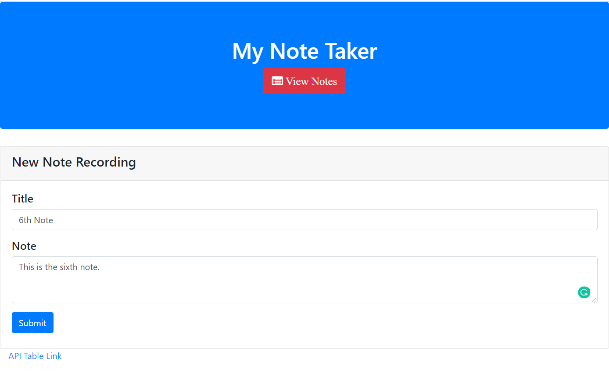
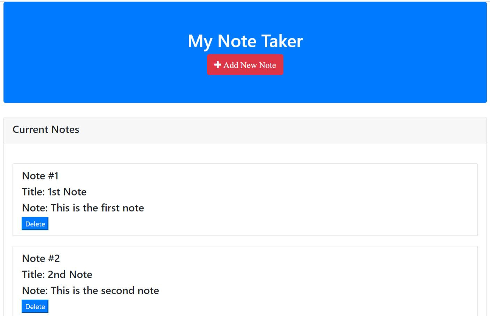
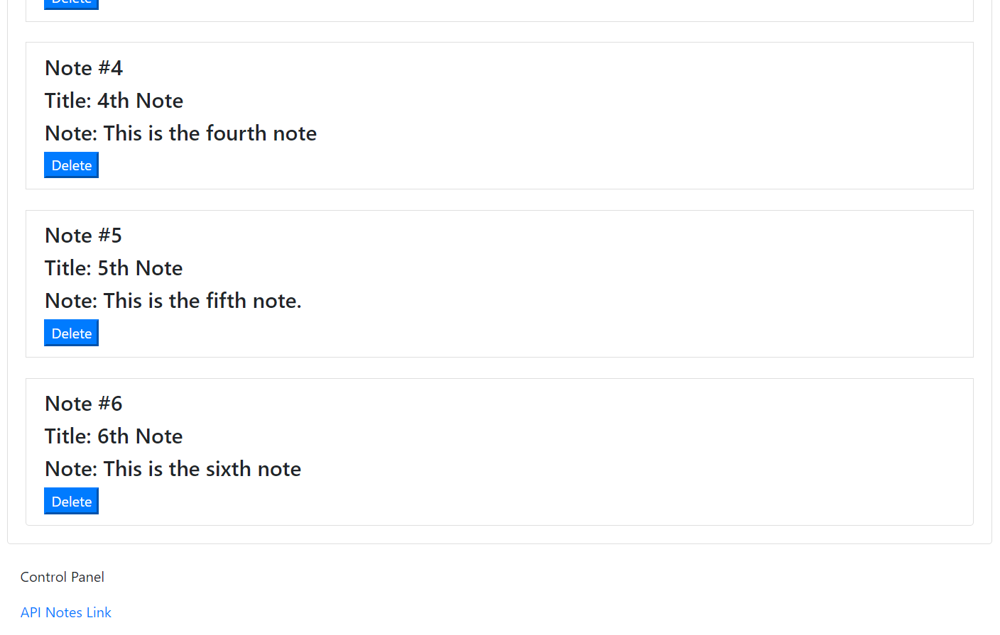

# Note-Taker
## Unit 11 Express Homework: Note Taker

This is a note taking application which can be invoked with the following code. 

```sh
npm start
```

Generated Html file can be viewed on localhost:8080



Express is used as a dependency.

User can add a new note with the title and description. 

db.json file is used to store notes data.
```sh
[
  {
    "id": 1,
    "title": "1st Note",
    "note": "This is the first note"
  },
  {
    "id": 2,
    "title": "2nd Note",
    "note": "This is the second note"
  },
  {
    "id": 3,
    "title": "3rd note",
    "note": "This is the third note"
  },...
  ```

  Use can see all saved notes on url "http://localhost:8080/notes"





User can also delete any note with delete button.